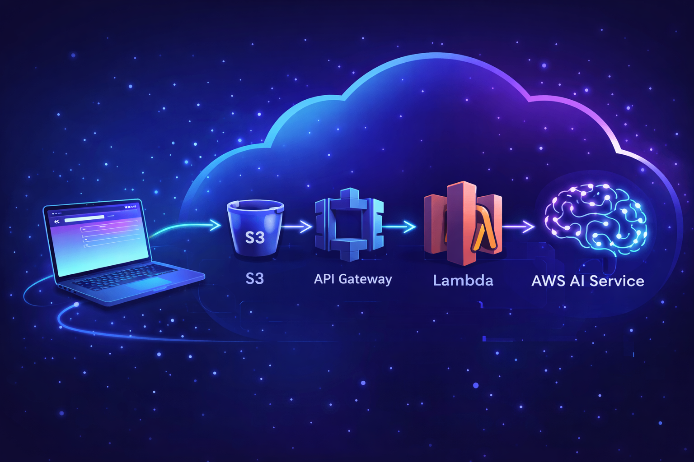

# Cloud 101 with AWS – Serverless AI Workshop

This repository contains the code and resources used in the **Cloud 101 with AWS** workshop.
The goal is to help beginners understand cloud computing by building a real, serverless application.

## What we built

A simple web app where:
- The frontend is hosted on Amazon S3
- APIs are exposed via Amazon API Gateway
- Backend logic runs on AWS Lambda (Python)
- An AWS AI service is used for sentiment analysis

Architecture:
Browser -> S3 -> API Gateway -> Lambda -> AWS AI Service

## Tech stack

- Amazon S3 (Static Website Hosting)
- Amazon API Gateway
- AWS Lambda (Python)
- AWS AI Service (Amazon Comprehend)
- HTML, CSS, JavaScript

## Folder structure

cloud-101-aws-workshop/
│
├── frontend/
│   ├── index.html
│
├── lambda/
│   ├── quote_function/
│   │   └── quote_lambda_function.py
│   └── sentiment_function/
│       └── sentiment_lambda_function.py
│
├── architecture/
│   └── architecture.png
│
├── setup/
│   ├── api-gateway.md
│   ├── s3-setup.md
│   └── lambda-setup.md
│
└── README.md
│
└── example-s3-policy

## How to run this yourself

### Prerequisites

Before you begin, make sure you have:

- An active AWS account
- Basic knowledge of Python/JSON/YAML
- Basic knowledge of HTML/CSS/JavaScript

---

### Step 1: Deploy Lambda functions

Create and deploy the backend Lambda functions using Python.  
These functions handle the quote generation and sentiment analysis logic.

👉 Follow the detailed steps here:  
[`lambda-setup.md`](setup/lambda-setup.md)

---

### Step 2: Configure API Gateway

Set up Amazon API Gateway to expose your Lambda functions as HTTP APIs.  
Each route will be connected to a different Lambda function.

👉 Follow the detailed steps here:  
[`api-gateway.md`](setup/api-gateway.md)

---

### Step 3: Host frontend on S3

Upload the frontend files to an Amazon S3 bucket and enable static website hosting.  
The frontend will call the API Gateway endpoints.

👉 Follow the detailed steps here:  
[`s3-setup.md`](setup/s3-setup.md)

---

## Learning outcomes

By completing this project, you will learn:

- What serverless means in practice
- How frontend and backend communicate in the cloud
- How APIs work in real applications
- How AI services can be integrated into cloud-based apps

---

## Cleanup

⚠️ **Important**

After testing, remember to delete the AWS resources you created  
(Lambda functions, API Gateway, and S3 bucket) to avoid unexpected charges.

